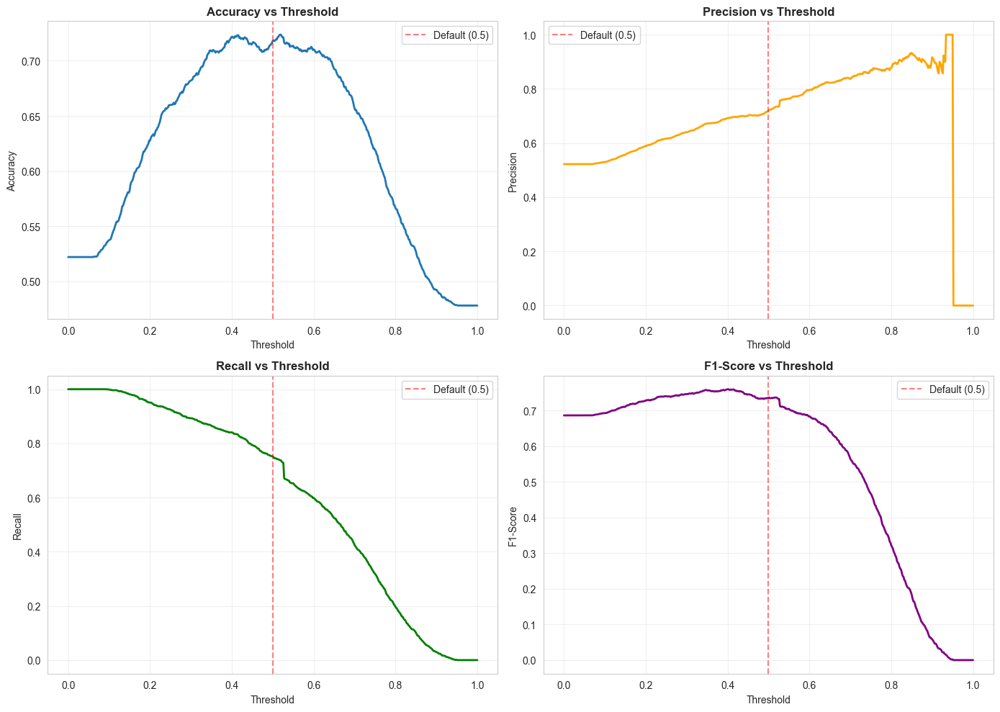
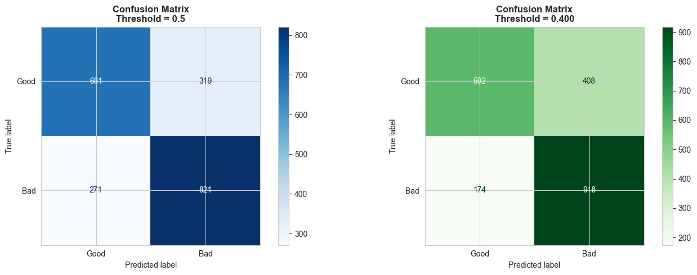

# Machine Learning for Credit Risk — XGBoost default-risk scoring on FICO HELOC data

CMPE 257 Machine Learning (SJSU, Prof. Flores) · Fall 2025 · Team (Group 7): Maxim Dokukin, Aditya Hegde, Girish Manne, Gandham Charan Sai · Status: Completed

## Overview

The project predicts whether a home-equity line of credit (HELOC) applicant is a **Good (0)** or **Bad (1)** credit risk from 23 credit-bureau
features in the FICO Explainable Machine Learning Challenge dataset (10,459 applicants). FICO's special codes (-9, -8, -7) are treated as
missing values and left to XGBoost's native missing-value handling, the target is flipped so that the high-risk class is positive, and an
XGBoost classifier is tuned with randomized search, class weighting and early stopping. Monotonic constraints derived from Spearman correlations
keep predicted risk moving in economically sensible directions, and a threshold sweep moves the decision cut-off from 0.50 to 0.40 so that more
Bad borrowers are caught. On a stratified 2,092-applicant test split the final model reaches 0.79 ROC-AUC and 0.84 Bad-class recall.

## Highlights

- **0.7925 ROC-AUC** and **0.7947 average precision** on the held-out test split (`notebooks/05-evaluate.ipynb`; report p.5–6)
- **Bad-class recall 0.84, precision 0.69, F1 0.76** at the chosen 0.40 threshold, accuracy 0.72 (report p.7; slide 8)
- Lowering the threshold from 0.50 to 0.40 cut missed Bad borrowers from **271 to 174**, at the cost of 408 instead of 319 false alarms (report p.9)
- Monotonic constraints on 19 of 23 features (9 increasing, 10 decreasing) from Spearman correlations with the target (`05-evaluate` cell 6)
- 6 of 6 predefined objectives passed (AUC ≥ 0.75, Bad recall ≥ 0.70, Bad precision ≥ 0.65, F1 ≥ 0.67, beat the 52.2% majority baseline)

## How it works

```
FICO_uncleaned.csv → special codes → NaN → flip target (Bad = 1) → Spearman monotone directions + scale_pos_weight
  → stratified train / validation / test (6,693 / 1,674 / 2,092) → RandomizedSearchCV (120 configs × 5 folds, ROC-AUC)
  → XGBoost with monotone_constraints + early stopping → threshold sweep (501 cut-offs) → 0.40 operating point → evaluation
```

- **`02-cleaning.ipynb`** — two cleaning variants: drop -9 rows and encode -8/-7 as 999 (`FICO_cleaned.csv`, 9,861 rows), or keep all rows with
  NaNs for XGBoost (`FICO_cleaned2.csv`, 10,459 rows — the one used for modelling).
- **`03-feature-engineering.ipynb`** — correlation heatmap, a reduced 6-feature set (`FICO_reduced.csv`, |r| > 0.2), first monotone-direction vector.
- **`04-train.ipynb`** — baseline XGBoost, Spearman-based monotone constraints (|ρ| < 0.1 → unconstrained), `scale_pos_weight`,
  `RandomizedSearchCV`, constrained final model, threshold sweep.
- **`05-evaluate.ipynb`** — rebuilds the same splits and model; ROC and precision–recall curves, metrics versus threshold, confusion matrices at
  0.50 and 0.40, gain/frequency feature importance, misclassification analysis, objective PASS/FAIL table.
- **`01-eda.ipynb`** — `ydata-profiling` report of the raw data, class balance, feature distributions, correlations, before/after cleaning comparison.



## Results

Test split: 2,092 applicants (1,092 Bad, 1,000 Good), stratified, `random_state=42`.

| Metric | Final model @ 0.40 | Final model @ 0.50 | Baseline XGBoost @ 0.50 |
|---|---|---|---|
| ROC-AUC | 0.7925 | 0.7925 | 0.7984 |
| Average precision | 0.7947 | 0.7947 | — |
| Accuracy | 0.7218 | 0.7180 | 0.7247 |
| Recall (Bad) | 0.8407 | 0.7518 | 0.76 |
| Precision (Bad) | 0.6923 | 0.7202 | 0.72 |
| F1 (Bad) | 0.7593 | 0.7357 | 0.74 |
| Recall (Good) | 0.592 | 0.681 | 0.68 |
| Missed Bad borrowers (FN) | 174 | 271 | 257 |

Final model = tuned hyperparameters + monotonic constraints + class weighting (`05-evaluate.ipynb`); baseline = untuned XGBoost without
constraints or class weights (`04-train.ipynb` cell 9, classification report rounded to two decimals). Ranking quality is essentially unchanged by
the constraints; the recall gain on Bad borrowers comes from the lower threshold, traded against Good-class recall. The most important
features by gain are ExternalRiskEstimate, NetFractionRevolvingBurden and PercentTradesNeverDelq.



## Getting started

```bash
python -m venv .venv
source .venv/bin/activate            # Windows: .venv\Scripts\activate
pip install --upgrade pip
pip install -r requirements.txt
pip install xgboost seaborn scipy pyarrow ydata-profiling   # also used by the notebooks
jupyter lab
```

Run the notebooks from `notebooks/` in order `02 → 03 → 04 → 05` (`01` any time); paths such as `../data/processed/…` are relative to that
folder. `02-cleaning` writes `data/processed/FICO_cleaned.csv` (gitignored) and `FICO_cleaned2.csv` (committed); `03` needs the former.
Data lives in the repo:

- `data/raw/FICO_uncleaned.csv` — original FICO HELOC data (10,459 × 24), from the Kaggle mirror of the FICO Explainable ML Challenge
  (provenance in `data/raw/dataset_.txt`)
- `data/raw/heloc_data_dictionary-2.{pdf,xlsx}` — FICO data dictionary with the published monotonicity expectations
- `data/processed/FICO_cleaned2.csv` — cleaned data used for training (NaNs kept for XGBoost)
- `data/FICO/FICO.csv` — the 9,871 rows that are not entirely -9

`06-inference-demo.ipynb` and `90-experiments-template.ipynb` are empty templates; no trained model is saved to `models/`.

## Documents

- [Final report](docs/report.pdf) — 16 pages, 12/01/2025
- [Final presentation](docs/slides.pdf) — 13 slides
- Figures: [ROC curve](docs/figures/roc_curve.png), [threshold sweep](docs/figures/threshold_sweep.png),
  [confusion matrices](docs/figures/confusion_matrices.png), [feature importance](docs/figures/feature_importance.png)
- Notebooks: `notebooks/01-eda.ipynb` … `05-evaluate.ipynb`; earlier exploration in `notebooks/legacy/`
- Case-study reference: W. Wang et al., "Using Small Business Banking Data for Explainable Credit Risk Scoring", AAAI 2020
